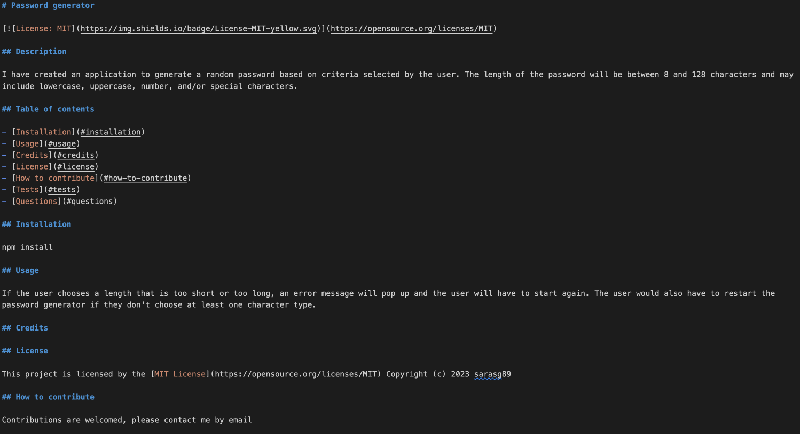

# README file generator

## Description

You can use this tool to easily and quickly generate a README file by using the command line. The generated file will contain all the sections that make up a good-quality, professional README: description, table of contents, installation, usage, credits, test, how to contribute, and license information.

## Table of contents

- [Installation](#installation)
- [Usage](#usage)
- [Screenshots](#screenshots)
- [Credits](#credits)
- [License](#license)

## Installation

Ensure that you have Node.js installed, v16 is best. You can follow [this](https://coding-boot-camp.github.io/full-stack/nodejs/how-to-install-nodejs) guide for installation instructions.  

Clone this repository:  
>`git clone git@github.com:sarasg89/easy-README.git`  

Navigate into the directory where you cloned this repository:  
>`cd ./easy-README`  

Run npm install to retrieve dependencies:  
>`npm install`  

## Usage

Open your terminal and navigate to the directory
>`cd ./easy-README`  

Run node to initialize the application
> `node index.js`

Answer the questions when prompted. After the last question, a README file will be created and saved in the folder called generated_README_files.

[Link](https://drive.google.com/file/d/1aYTYxM4f7E7U3WBCO7O6K05iKL-QtD54/view) to video showing an example of how to use this application.

[Link](https://drive.google.com/file/d/1Rts6_Lus1Jvmd7fbvST4D9puKcFUDfOd/view) to the walkthrough of the generated README file. 

### Screenshots

## Credits

[How to create a Professional README](https://coding-boot-camp.github.io/full-stack/github/professional-readme-guide)

[Starter code](https://github.com/coding-boot-camp/potential-enigma)

NPM packages used:  

* [inquirer](https://www.npmjs.com/package/inquirer)
* [email validator](https://www.npmjs.com/package/email-validator)
* [day.js](https://day.js.org/)  

Markdown License badges by [lukas-h](https://gist.github.com/lukas-h/2a5d00690736b4c3a7ba)

## License

MIT License

Copyright (c) 2023 sarasg89

Permission is hereby granted, free of charge, to any person obtaining a copy of this software and associated documentation files (the "Software"), to deal in the Software without restriction, including without limitation the rights to use, copy, modify, merge, publish, distribute, sublicense, and/or sell copies of the Software, and to permit persons to whom the Software is furnished to do so, subject to the following conditions:

The above copyright notice and this permission notice shall be included in all copies or substantial portions of the Software.

THE SOFTWARE IS PROVIDED "AS IS", WITHOUT WARRANTY OF ANY KIND, EXPRESS OR IMPLIED, INCLUDING BUT NOT LIMITED TO THE WARRANTIES OF MERCHANTABILITY, FITNESS FOR A PARTICULAR PURPOSE AND NONINFRINGEMENT. IN NO EVENT SHALL THE AUTHORS OR COPYRIGHT HOLDERS BE LIABLE FOR ANY CLAIM, DAMAGES OR OTHER LIABILITY, WHETHER IN AN ACTION OF CONTRACT, TORT OR OTHERWISE, ARISING FROM, OUT OF OR IN CONNECTION WITH THE SOFTWARE OR THE USE OR OTHER DEALINGS IN THE SOFTWARE.
